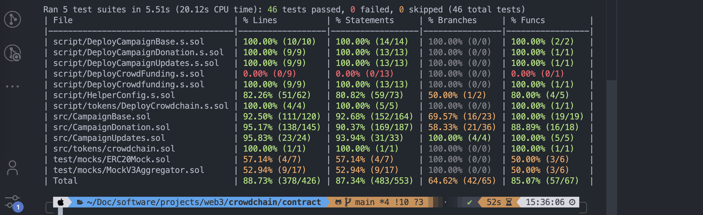

# CrowdChain

CrowdChain is a decentralized crowdfunding platform built on the Ethereum blockchain. It allows users to create and contribute to various campaigns, with the option to set up milestones for the campaigns.

## Table Of Content
- [CrowdChain](#crowdchain)
  - [Table Of Content](#table-of-content)
  - [About](#about)
  - [Features](#features)
  - [Technologies Used](#technologies-used)
    - [Frontend(Client)](#frontendclient)
    - [Blockchain (Contracts)](#blockchain-contracts)
    - [Backend (Server)](#backend-server)
  - [Project Structure](#project-structure)
    - [Contracts](#contracts)
      - [CampaignBase Contract](#campaignbase-contract)
      - [Crowdfunding Contract](#crowdfunding-contract)
      - [CrowdfundingUpdates Contract](#crowdfundingupdates-contract)
      - [CrowdchainToken Contract](#crowdchaintoken-contract)
    - [Client](#client)
    - [Server](#server)
  - [Testing](#testing)
  - [Deployment](#deployment)
  - [Upcoming Features](#upcoming-features)
  - [Screenshots](#screenshots)

## About

CrowdChain is designed to provide a decentralized and transparent platform for crowdfunding. Users can create campaigns with or without milestones. Milestones can be `Pending`, `InProgress`, `Completed`, `Approved`, `Rejected`.

For campaign without milestones, donors can request for a refund before the campaign refund deadline has passed. Campaign owner can withdraw the campaign funds once the refund deadline is over.

For campaigns with milestone, donors can request for a refund before the first milestone is approved. Milestone approval happens when the campaign owner has withdrawn the funds raised for the milestone.

Campaign owners can update their donors about the current status of their campaign by posting updates.

Tokens are awarded to donors at the end of each successful campaign. Also, a fee of 2% is paid to the creator of the contract(me of course😅).

## Features

- **Campaign Creation**: Users can create crowdfunding campaigns with or without milestones.
- **Donations**: Donors can contribute to active campaigns using Ether (ETH).
- **Milestones**: Campaigns can be set up with up to 4 milestones, each with its own target amount and deadline.
- **Withdrawal**: Campaign owners can withdraw the funds once the campaign's goal is reached or a milestone is completed.
- **Refunds**: Donors can request refunds for their contributions before the campaign's refund deadline.
- **Token Distribution**: Successful campaigns will distribute a CrowdChain (CC) token to all donors proportional to their contributions.

## Technologies Used

### Frontend(Client)

- **`Next.js`**: React framework for building the user interface.
- **`TailwindCSS`**: Utility-first CSS framework for styling the application.
- **`ShadCn`**: UI component library.
- **`React Hook Form`**: Form management library.
- **`Zustand`**: State management library.
- **`Wagmi`**: Ethereum blockchain interaction library.
- **`React Query`**: Data fetching and caching library.
- **`Connectkit`**: Wallet connection library.

### Blockchain (Contracts)

- **`Solidity`**: Programming language for writing the smart contracts.
- **`Foundry`**: Development environment.

### Backend (Server)

- **`Express.js`**: Backend server.
- **`Pinata-web3`**: Library for uploading campaign cover images to the IPFS decentralized storage network.
- **`Redis`**: To cache some information displayed on the home page.
- **`Viem`**: To communicate with the blockchain.

## Project Structure

The CrowdChain project is divided into three main parts:

### Contracts

The contract folder contains the smart contracts for the CrowdChain platform. The main contracts are:

#### CampaignBase Contract

This is an abstract contract that provides the core functionality to create a campaign, withdraw from a campaign and request refunds.

#### Crowdfunding Contract

This contract extends the CampaignBase contract and adds the donation and refund functions.

#### CrowdfundingUpdates Contract

This contract extends the Crowdfunding contract and adds functionality to post and get updates.

#### CrowdchainToken Contract

This contract is an ERC20 token that is distributed to successful campaign donors.

### Client

The client folder contains the Next.js-based frontend application that allows users to interact with the CrowdChain platform.

### Server

The server folder contains the Express.js-based backend server responsible for handling the upload of campaign cover images to the IPFS network.

## Testing

The important functions in the smart contracts have been thoroughly tested using foundry.

## Deployment

CrowdChain is currently deployed on the Sepolia Ethereum test network.

Address: `0x33b8AA943D007A5b39e2f56BF3bb6575e7EEB487`

## Upcoming Features

- [x] Display total donations and donors on the home page
- [x] Display recent donations on the home page
- [x] Allow campaign owners to post updates
- [ ] Allow donors to claim their CrowdChain (CC) tokens.
- [ ] Allow donors with `CC` tokens to vote in a milestoned campaign.
- [ ] Allow donors with `CC` tokens to vote for urgent withdraw of campaign funds.
- [ ] Allow donors to also donate `USDT` as it's a stablecoin.
- [ ] Provide a means to get current price of `ETH`.

## Screenshots

Mobile -> home page

---

Mobile -> create campaign page

---

Desktop -> home page

---

Desktop -> create campaign page

